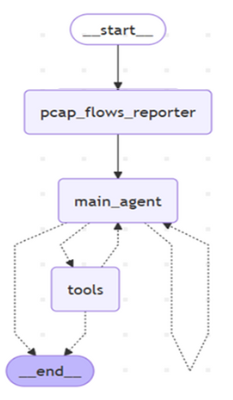

# Flow Reporter Agent

In the current branch is implemented a LangGraph-based AI agent capable of performing autonomous forensic analysis on network events captured in `.pcap` files.  
The architecture structure represents the ***Flow Reporter***, reported in the image below:  

   
 
Given a benchmark dataset, the agent detects vulnerabilities (e.g., CVEs), identifies affected services, and produces structured reports. 

The system first analyses each tcp flow through a PCAP_flows_analyzer, then instantiates an agent to loop on findings, make research online and provide a final report with all findings related to the forensic task. 

---

## How to switch architecture  

We have designed and experimented with **five different agent architectures**, each exploring a distinct input and analysis workflow.  
All architectures are available in this repository, organized into separate Git branches:  

- **main** → *Flow Reporter*: a lightweight pipeline that generates forensic reports directly from network flows.  
- **single_agent** → *Single-Agent Baseline*: a minimal architecture where a single agent handles the full forensic analysis.
- **tshark_expert** → *Tshark Expert*: a multi-agent setup focused on executing arbitrary `tshark` commands to extract insights from PCAP traces.  
- **tshark_expert_plus_logs** → *Tshark Expert + Logs*: an extended version that combines `tshark`-based analysis with system log inspection for richer context.  
- **flow_reporter_plus_logs** → *Pipeline of Agents*: a multi-agent pipeline where three specialized agents collaborate sequentially, combining flow analysis, log inspection, and forensic reasoning for more accurate CVE identification.  

Each branch represents a step in our exploration of how **different coordination strategies (single-agent vs. multi-agent pipelines)** impact performance, accuracy, and token efficiency when applied to **cybersecurity forensic tasks**.  

Each architecture can be tested by simply switching to the corresponding branch and following the instructions in each README. 

---

##  Repository Structure

```
project-root/
├── data/                                # Dataset folder
│   ├── CFA-benchmark/                   # CFA dataset
│   │   ├── raw/                         # Raw PCAPs and logs
│   │   │   └── eventID_<n>/             # One folder per forensic challenge
│   │   └── tasks/                       # Tasks metadata
│   │       └── data.json                # JSON file containing all tasks
│   │
│   ├── TestSet_benchmark/              # Test set for evaluation
│   │   ├── raw/                         # Raw PCAPs and logs
│   │   │   └── eventID_<n>/             # One folder per forensic challenge
│   │   └── tasks/                       # Tasks metadata
│   │       └── data.json                # JSON file containing all tasks
│   │
│   └── web_browsing_traffic/           # Non-malicious traffic samples
│       ├── raw/                         # Raw PCAPs
│       │   └── eventID_<n>/             # Events related to non malicious traffic, no ground truth required
│
├── src/                                 # Source code
│   ├── run_agent.py                     # Entry point to execute the agent
│   ├── configuration.py                 # Reads environment variables and agent settings
│   ├── multi_agent/                     # Contains the code for all the agents
│   ├── browser/                         # Code related to the web search tool
│   └── .env_example                     # Example of environmental variables file
│
├── requirements.txt                     # Python dependencies
├── results/                             # Results folder containing logs and reports for each rn (for each execution on the benchmark)
└── README.md                            # Instructions on how to execute the agent

```

---

## How to Run the Agent

Follow these steps to install dependencies, configure the environment, and execute the agent.


### 1. Set Up the Python Environment

Create and activate a virtual environment:

```bash
python -m venv venv
venv\scripts\activate.ps1  
```

Then install the required packages:

```bash
pip install -r requirements.txt
```

---

##  Wireshark / TShark Dependency

This project requires the command-line tool **TShark** to analyze `.pcap` files.

TShark is part of the [Wireshark](https://www.wireshark.org/) network analysis suite and must be **installed and accessible via the system `PATH`**.

###  Installation Instructions

1. **Download Wireshark** from the official site:  
  https://www.wireshark.org/download.html

2. During installation:
   -  **Enable the option to install `TShark`**
   -  **Select the option to add Wireshark to the system `PATH` or do it manually once it has been installed**

---


### 2. Configure Environment Variables

From the `src/` folder, copy the example file:

```bash
cd src
cp .env.example .env   # Linux/macOS
copy .env.example .env  # Windows
```

See step 3 below for which keys to fill in.

---

### 3. Configure the `.env` file

Rename `.env.example` to `.env` and fill in the keys that match your chosen model:

| Variable | Required when |
|---|---|
| `OPENAI_API_KEY` | Always (used for embeddings, or as the LLM) |
| `GOOGLE_GENERATIVE_AI_API_KEY` | `MODEL=google/gemini-*` |
| `DEEPSEEK_API_KEY` | `MODEL=deepseek/*` |
| `ANTHROPIC_API_KEY` | `MODEL=anthropic/*` |
| `GOOGLE_API_KEY_1` + `GOOGLE_CSE_ID` | Web-search tool (online research) |
| `NVD_API_KEY` | Optional — raises NVD rate limit 5 → 50 req/30 s |

---

### 4. Run the Agent

All commands are run from the `src/` directory.

#### Quick reference — CLI options

```
python run_agent.py [options]

  --event   N          Run a single event by index (e.g. 0)
  --events  LIST|all   Comma-separated indices or "all"  (e.g. 0,4,3)
  --model   PROVIDER/MODEL  Override the MODEL env var at runtime
  --dataset CFA|test   Which benchmark to use (default: CFA)
  --runs    N          Number of full passes over the selected events (default: 1)
  --output  FILE       Save per-event results as JSON
  --report  FILE       Save the final summary report to a text file
  --metrics            Print a per-event breakdown table at the end
  --verbose            Enable verbose logging
  --log     FILE       Write execution log to a file
```

#### Phase 1 — Verify a single event

```bash
python run_agent.py --event 0 --model google/gemini-2.5-pro
```

#### Phase 2 — Quick validation on a handful of events

```bash
python run_agent.py --events 0,4,3 --model deepseek/deepseek-r1 --metrics
```

#### Phase 3 — Full benchmark (all events, save results)

```bash
# CFA benchmark (20 events)
python run_agent.py --events all --model deepseek/deepseek-r1 \
    --output results/cfa_results.json \
    --report results/cfa_summary.txt \
    --metrics

# Test-set benchmark (10 events, 2025 CVEs)
python run_agent.py --events all --dataset test --model google/gemini-2.5-pro \
    --output results/test_results.json \
    --report results/test_summary.txt
```

#### Multiple runs (statistical averaging)

```bash
python run_agent.py --events all --runs 3 --model openai/gpt-4o \
    --output results/multi_run.json
```

The script will, for each selected event:

1. Instantiate a new LangGraph agent with a fresh memory store
2. Run forensic analysis on the corresponding `.pcap` file
3. Write step-by-step reasoning to `results/run[n]/log_steps/steps_event<id>.txt`
4. Append the structured report to `results/run[n]/result.txt`
5. Save per-event metrics (tokens, cost, latency) to `results/run[n]/event_results.json`

At the end, a summary is printed (and optionally saved) containing accuracy metrics, F1/MCC scores, total token counts, and estimated cost.

#### Testing on non-malicious traffic

Run the following command from the `src/` directory:

#### Executing one of the two benchmarks (CFA or test set):

```bash
python run_agent.py
```

The script will:

- Iterate through all events in `tasks/data.json`
- For each event:
  - Instantiate a new LangGraph agent
  - Run the analysis on the corresponding `.pcap` file
  - Log the step-by-step reasoning into `results/run[n]/log_steps`
  - Append results to `results/run[n]/result.txt`

At the end, it prints performance metrics (e.g., accuracy) to `stdout` and to the file `results/run[n]/result.txt` for each execution.

#### Testing on non-malicious traffic

The folder `data/web_browsing_traffic` contains data from normal web browsing, with no malicious activity involved. Although the agent is prompted with a bias toward detecting malicious behavior (as defined in the benchmark), we also evaluated it on this benign scenario.

To run the test, simply execute:

```bash
python run_agent_web_events.py
```

The final output will be the same reported before without perfornance metrics, as there is no ground truth in this case, since there is no malicious activity. In the file in `data/web_browsing_traffic/gt.txt` there is, for each event, the corresponding event that we were browsing when collecting data. Because the traffic is TLS-encrypted, the corresponding decryption key is also provided for each event, enabling the agent to analyze the content in an automatic manner.


---

## Output Artifacts

- `results/run[n]/log_steps/`: One file per event, detailing internal reasoning and tool calls
- `results/run[n]/result.txt`: Final report for each event (e.g., predicted CVE, vulnerable status)

---

##  Structure of the Benchmark

The benchmark is designed to evaluate the agent’s ability to perform forensic analysis on malicious network traffic (there is always an attempted attack against a web service). Thus, for each event, it is assumed that an attack has occurred. The goal of the agent is to:

- **Determine the affected service**
- **Detect the correct CVE ID**, if applicable
- **Assess whether the service is vulnerable**
- **Assess whether the attack was successful**
- **Generate a concise report**
---
## How to specify model and provider

To configure the model and provider, set the appropriate variable in your `.env` file.

### Official providers (e.g., OpenAI)

Use the provider name followed by a `/` and the model identifier. Examples:

- openai/gpt-4o
- openai/o3
- openai/gpt-5
  

### Third-party providers (e.g., Together AI)

Specify the provider name first, then append the model identifier in the same format as before. Example:
 -together/meta-llama/Llama-4-Maverick-17B-128E-Instruct-FP8

---

## Warning  

Some benchmark events may be highly token-intensive. Analyzing partial network traces often requires providing a large amount of input tokens.
Make sure that your plan and tier (for whichever model you use) support a sufficiently high tokens-per-minute rate to run the evaluation. 

---

